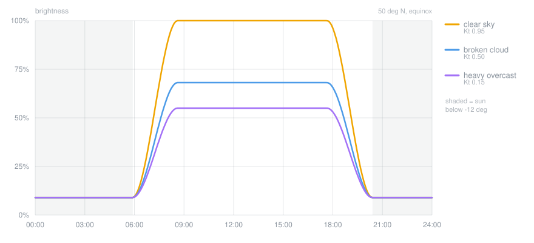

<h1 align="center">Adaptive Brightness</h1>

<p align="center">
  <em>Your monitor should be as bright as the day actually is — not as bright as the calendar says.</em>
</p>

<p align="center">
  <a href="https://github.com/yakubmurcek/adaptive-brightness/actions/workflows/tests.yml"></a>
  
  
  <a href="LICENSE"></a>
  
</p>

Sets your **external monitor's** brightness over DDC/CI from the sun's position *and how bright
the sky actually is* — full brightness in direct sun, noticeably lower under thick cloud, dim at
night, with a long smooth fade through twilight.

No tray app, no service, no account, no API key, no driver. Two PowerShell scripts and a
scheduled task.



<p align="center">
  <sub>Not a mockup — <a href="Tools/New-CurveChart.ps1"><code>Tools/New-CurveChart.ps1</code></a>
  generates this by calling the real model, so the picture cannot drift from the behaviour.</sub>
</p>

Same day, same latitude, same sun. The only thing that changed is the sky — and that is the whole
point: **sun position alone cannot tell a dazzling noon from a dark grey one.**

## Quick start

```powershell
git clone https://github.com/yakubmurcek/adaptive-brightness.git
cd adaptive-brightness
.\Install.ps1
```

That is the whole install. It finds your approximate location by IP, writes `config.json`,
registers the task and starts it. Prefer not to be geolocated? `.\Install.ps1 -Latitude 40.7128
-Longitude -74.0060`.

## Design notes

The parts worth a look if you are reading this as code rather than as a utility:

- **The decision logic is pure.** [`BrightnessCore.ps1`](BrightnessCore.ps1) does no I/O — no
  network, no DDC, no clock reads — so a simulated eight-hour broken-cloud day, a twenty-hour
  network outage and a full year of sunrises all run in milliseconds. **154 tests**, none of which
  need a monitor.
- **Clouds are measured, not inferred.** The clearness index `Kt` is a *ratio*, so it means the
  same thing in January as in July, in Oslo as in Nairobi. [Why that matters ↓](#how-it-works)
- **Time constants, not fixed weights.** The smoothing uses `α = 1 − e^(−Δt/τ)`, so a late tick, a
  rapid burst and a six-hour hibernation are all weighted correctly instead of the EMA quietly
  lying about how much it knows. [↓](#staying-smooth)
- **"No reading because it's dark" ≠ "no reading because the network died."** Kt is *undefined* at
  night, not missing, so the staleness clock stops at sunset. Letting it run was a real bug: an
  overcast evening decayed to neutral overnight and the panel came up near-full on a grey morning.
  [↓](#when-the-data-isnt-there)
- **It never fights you.** Touch the monitor's own buttons and it notices the gap, stands down for
  two hours, and eases back on from where *you* left it. [↓](#manual-control)
- **It ticks 6× faster than it used to and costs 4× less CPU.** One resident process that sleeps,
  paced by the work rather than the clock. [↓](#staying-cheap)

## Why not just use the sun's position?

That's what this project used to do, and it was wrong about half the time. The sun's altitude is
pure geometry — it cannot tell a dazzling cloudless noon from a dark grey one. Both put the sun
at the same height, so both got 100%, and on overcast days the screen was painfully bright.

So the sky has to be measured, not inferred.

## How it works

Two signals, each doing the job it is actually good at.

**1. Sun altitude decides day versus night.** Computed offline with the NOAA solar position
algorithm, so this half never depends on a network. A smoothstep ramp across twilight keeps the
transition gentle and free of any kink where it meets full day or full night.

**2. The clearness index decides what "day" is worth today.**

```
Kt = measured irradiance / clear-sky irradiance
```

The numerator is `shortwave_radiation` from [Open-Meteo](https://open-meteo.com) — real global
horizontal irradiance in W/m², free and keyless. The denominator is a Haurwitz clear-sky model
computed locally from the sun's altitude.

Because it is a *ratio*, Kt means the same thing in every season and at every latitude:

| Kt | Sky |
|---|---|
| 0.90 – 1.00 | cloudless |
| 0.60 – 0.90 | thin or broken cloud |
| 0.35 – 0.60 | properly cloudy |
| 0.10 – 0.30 | heavy overcast |

This is why raw W/m² is *not* used directly: 250 W/m² is a dull, dim day in July and a blinding
clear noon in January. The ratio cancels that out.

The two combine as:

```
brightness = Night + (DayCeiling(Kt) - Night) × SunFactor(altitude)
```

Night is the floor when the sun is down, so **cloud cover correctly stops mattering after dark**.

## Staying smooth

Weather data is jumpy — consecutive readings can differ by 40%. Three independent layers keep the
panel calm anyway:

| Layer | Default | What it stops |
|---|---|---|
| **EMA on Kt** | τ = 30 min | Chasing every passing cloud. Uses a real time constant, so an unevenly spaced or long-delayed tick is weighted correctly. |
| **Rate limit** | 3 %/min | Any single correction becoming a visible jolt. A 45-point swing takes ~15 min. |
| **Deadband** | 4 % | Endless 61–62–61 ticking on data noise. |
| **DDC glide** | 25 ms/point | The move itself looking like a step. |

Measured over a simulated 8-hour broken-cloud day with ±0.3 Kt noise: **12 brightness changes,
largest step 5.5 points, total excursion 12 points**. Over a full clear day, no step exceeds
6 points.

## Staying cheap

It used to be a scheduled task firing every two minutes. That is a poor deal twice over: two
minutes is slow enough to see the panel lag a cloud, and every one of those 720 daily runs paid
about **1.2 s of CPU** to start PowerShell, parse the scripts and JIT-compile the DDC interop
before doing a few milliseconds of actual work.

So it is now one resident process that sleeps between ticks. A sleeping thread costs nothing
measurable — 0.000 s of CPU over two idle minutes, measured — which means the tick can be much
*faster* while the whole thing costs much less. Responsiveness and power usually trade against
each other; here they did not.

The pace follows the work rather than the clock:

| Situation | Tick | Why |
|---|---|---|
| Mid-move, or target outside the deadband | **20 s** | You can see this happening; track it closely. |
| Settled | doubles 20 → 40 → 80 s, capped at **180 s** | Nothing is happening. Back off, but stay quick to wake. |
| Sun below `RampLowDeg`, settled | **600 s** | Below the ramp the altitude term is pinned; only the calendar can change it. A correction still in progress keeps the 20 s pace. |
| On battery | every interval × **3** | A laptop away from the wall would rather have slightly laggy brightness. |

The network call is gated separately, at **once per 10 minutes**. Open-Meteo publishes on roughly
a 15-minute cadence, so polling it every 20 seconds returns the same number dozens of times over.
Nothing is lost by reusing it: only the *sky* term needs the network, and the *sun* term — which
is what actually moves the panel minute to minute — is local geometry, recomputed every tick for
free.

Measured on this machine: **878 s of CPU per day before, ~206 s after** — about 4× cheaper, while
reacting up to 6× faster when there is something to react to. Overnight it is cheaper still.

An uneventful tick writes nothing to the log, so a 20-second tick does not turn into megabytes of
`holding at 79%`; a heartbeat every 30 minutes still proves it is alive.

## When the data isn't there

A brightness controller must never fail loudly, and must never pretend to know things.

- **Network down, reading under 3 h old** — the cached value is held unchanged.
- **Network down longer** — Kt eases toward a neutral 0.5 over ~1 h. It never jumps.
- **Never had a reading** — a neutral 0.5 is used, and deliberately *not* remembered, so the first
  real reading is adopted outright instead of being averaged against a guess.
- **After dark** — Kt is undefined, not missing, so the last known sky is frozen rather than aged
  out. An overcast evening therefore stays overcast until dawn, which is a far better morning
  prior than any fixed constant.
- **Sun below ~5°** — irradiance ratios are numerical noise down there, so no reading is taken.
- **Long sleep or hibernation** — fresh data is allowed to dominate the average, but the *actuator*
  gets a separate capped elapsed time (`MaxCatchUpMinutes`), so waking up produces a brisk
  correction rather than a snap.

## Manual control

The panel is read before it is written. A level we did not command means you reached for the
monitor's own buttons, so the script stands down for `OverrideMinutes` (default 2 h) instead of
fighting you every two minutes. It then eases on from where you left it. Touch it again while it
is standing down and the clock restarts from that touch.

A gap only counts as you if the script was watching. Many monitors come back from sleep or a
power cycle at their own default level, so after `ResyncAfterMinutes` (default 45) with no look at
the panel — the PC slept, the monitor was off — a changed level is taken as the new starting point
and faded from, not treated as a two-hour "hands off".

```powershell
.\Set-AdaptiveBrightness.ps1 -Pause           # stop adjusting; survives reboots
.\Set-AdaptiveBrightness.ps1 -Resume
.\Set-AdaptiveBrightness.ps1 -ClearOverride   # take control back now
.\Set-AdaptiveBrightness.ps1 -Status          # what it thinks, touching nothing
```

## Requirements

- Windows 10/11, PowerShell 5.1 or 7+ (7 is used automatically if installed)
- A monitor with **DDC/CI enabled** — check its OSD menu, it is often off by default
- Internet access for the sky reading. Without it you get sun-only behaviour, safely.

## Install

The commands are in [Quick start](#quick-start); this is what they actually do.

`Install.ps1` finds your approximate location by IP, writes `config.json`, registers the scheduled
task, starts it, and retires the older sun-only task if it is still present.

The task starts one resident process at logon that then ticks on its own timer. A watchdog
trigger re-checks every 15 minutes and restarts it if it ever died; while it is alive that check
costs nothing, because the task is registered to ignore a second instance.

To remove it again:

```powershell
.\Uninstall.ps1                 # removes the task, keeps your config
.\Uninstall.ps1 -RemoveConfig   # removes everything it ever wrote
```

Your monitor is left at whatever brightness it currently has.

## Configuration

Everything lives in `config.json`. Changes take effect on the next tick — no reinstall.

| Setting | Default | Meaning |
|---|---|---|
| `Latitude` / `Longitude` | *(from install)* | Decimal degrees, north and east positive. |
| `DayBrightness` | `100` | Percent under a cloudless sky. |
| `OvercastBrightness` | `55` | Percent under heavy overcast, sun still up. **Tune this first.** |
| `NightBrightness` | `9` | Percent after dark. |
| `MinBrightness` / `MaxBrightness` | `5` / `100` | Hard envelope; nothing escapes it. |
| `RampLowDeg` | `-12.0` | Sun altitude at which the night level is reached. |
| `RampHighDeg` | `14.0` | Sun altitude at which the full day level is reached. |
| `KtLow` | `0.25` | Kt at or below which `OvercastBrightness` is used. |
| `KtHigh` | `0.95` | Kt at or above which `DayBrightness` is used. |
| `KtFallback` | `0.50` | Assumed sky when nothing is known. |
| `KtTauMinutes` | `30.0` | Sky smoothing time constant. Raise to react more slowly. |
| `KtMaxAgeMinutes` | `180.0` | How long a cached reading is trusted before it decays. |
| `MaxRatePerMinute` | `3.0` | Maximum percentage points of change per minute. |
| `DeadbandPct` | `4.0` | Targets closer than this are ignored; farther ones are faded to. |
| `GlideStepMs` | `25` | Milliseconds between 1-point fade steps. `0` = instant. |
| `OverrideTolerancePct` | `6.0` | Gap from our commanded level that counts as you intervening. |
| `OverrideMinutes` | `120` | How long to stand down after you intervene. |
| `MaxCatchUpMinutes` | `10.0` | Caps the change budget after a long gap. |
| `ResyncAfterMinutes` | `45.0` | Unwatched this long, a changed panel is a wake-up, not you. |
| `TickSeconds` | `20` | Gap between ticks while something is moving. |
| `IdleTickSeconds` | `180` | Gap once the panel has settled. |
| `NightTickSeconds` | `600` | Gap once the sun is below `RampLowDeg`. |
| `WeatherIntervalMinutes` | `10.0` | How often the sky is re-measured over the network. |
| `BatteryFactor` | `3.0` | Every gap is multiplied by this on battery. `1.0` disables it. |
| `HeartbeatMinutes` | `30` | Log an uneventful tick at least this often. |
| `TimeoutSec` | `10` | Weather request timeout. |

### Tuning it to your taste

The one number most worth adjusting is `OvercastBrightness`. Watch what it picks on a grey day,
decide what you actually wanted, and set it there.

To see the whole response curve without waiting for the weather:

```powershell
foreach ($kt in 0.05, 0.25, 0.5, 0.75, 0.95) {
    .\Set-AdaptiveBrightness.ps1 -SimulateKt $kt -WhatIfOnly
}
```

Want a longer twilight fade? Widen the gap between `RampLowDeg` and `RampHighDeg`.
Want it to react faster to clouds, at the cost of more movement? Lower `KtTauMinutes` and raise
`MaxRatePerMinute`.

## Tests

```powershell
pwsh -File .\Tests\Run-Tests.ps1              # 123 tests, no monitor or network needed
pwsh -File .\Tests\Run-IntegrationTests.ps1   # 31 tests against the real monitor
```

All decision logic is in `BrightnessCore.ps1` as pure functions, so a whole simulated day, a
three-hour outage, or a cloud bank arriving at noon all run in milliseconds. The suite covers
sunrise-to-midnight sweeps, clear versus overcast days, noisy broken cloud (asserting bounded
oscillation), network loss and recovery, the overnight hold, tick pacing, network-call gating,
and manual override.

The unit suite needs no hardware, which is exactly why it runs in CI on every push — a brightness
algorithm you cannot test without waiting for sunset is one you cannot safely change.

The integration suite drives the real DDC/CI path — override detection, pause/resume, corrupt
state, offline operation. **It moves your monitor brightness while it runs** and restores the
level and state file when it finishes.

## Logs

`brightness.log`, UTF-8, rotated at 1 MB:

```
2026-09-22 12:07:45 [info ] sun  39.17 deg | GHI 380 of 634 W/m2, cloud 64%, direct 47% | Kt 0.60 (live (cold start)) | ceiling 77% | target 77%
2026-09-22 12:07:46 [act  ] 100% -> 77% (stepping toward target)
2026-09-22 12:07:48 [info ]   Generic PnP Monitor : 100 -> 77 raw (range 0-100)
```

Every line shows the measurement, the derived Kt, where it came from, and why the level moved or
did not. `cloud` and `direct` are logged for diagnosis only — they explain why a sky that *looks*
cloudy can still read bright (broken cloud with the sun visible).

`state.json` holds the smoothed Kt, the last commanded level, and any override or pause.

## Known limitations

- **The sky reading is regional, not your window.** Open-Meteo gives conditions for your grid
  cell, not the light in your room. A local shower or a building shadow will not register.
  A hardware ambient-light sensor would; this machine has none.
- **Irradiance is a forecast-model value** on a 15-minute grid, typically interpolated and
  sometimes up to ~15 minutes behind reality. With a 30-minute smoothing constant that is
  deliberate, not accidental — but a sudden squall shows up late.
- **It does not know which way your window faces.** Global *horizontal* irradiance is used, so a
  low sun blazing directly through a west window reads lower than it feels. Raising
  `OvercastBrightness` or narrowing the Kt window compensates crudely; true correction would need
  the plane-of-array irradiance for your window's azimuth.
- **Room lighting is invisible to it.** Turning on a lamp at midnight changes nothing.
- **Multi-monitor setups all get the same level**, and monitors reporting no DDC/CI support are
  skipped. Laptop internal panels generally do not expose DDC/CI; Windows handles those natively.
- **Override detection cannot tell you from another program.** Anything else that sets brightness
  over DDC/CI looks like a manual change and will trigger a 2-hour stand-down.
- **The first grey morning after a fresh install** briefly runs on the neutral fallback until the
  sun clears ~5° and a real reading arrives. Afterwards the overnight hold prevents this.
- **DDC/CI is slow and not always reliable.** Some monitors ignore rapid writes or drop them under
  load; raise `GlideStepMs` if a fade looks choppy.

## Project layout

| File | What it is |
|---|---|
| [`BrightnessCore.ps1`](BrightnessCore.ps1) | The model. Pure functions, no I/O — this is the interesting half. |
| [`Set-AdaptiveBrightness.ps1`](Set-AdaptiveBrightness.ps1) | Plumbing: config, state, HTTP, DDC/CI, logging, the daemon loop. |
| [`Install.ps1`](Install.ps1) / [`Uninstall.ps1`](Uninstall.ps1) | Scheduled-task setup and removal. |
| [`Tests/`](Tests) | 123 unit tests (no hardware) and 31 integration tests (real monitor). |
| [`Tools/New-CurveChart.ps1`](Tools/New-CurveChart.ps1) | Regenerates the chart above from the model. |
| [`Set-SunBrightness.ps1`](Set-SunBrightness.ps1) | The original sun-only version, kept for reference. |

## Contributing

Bug reports and pull requests welcome — see [CONTRIBUTING.md](CONTRIBUTING.md). The one rule that
matters: decision logic goes in `BrightnessCore.ps1` and stays pure.

Version history is in [CHANGELOG.md](CHANGELOG.md).

## License

MIT © [Yakub Murcek](https://github.com/yakubmurcek)
